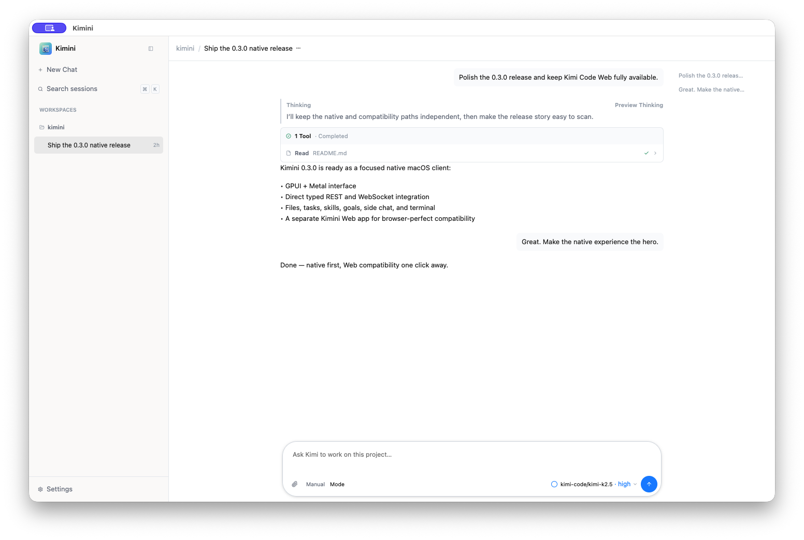
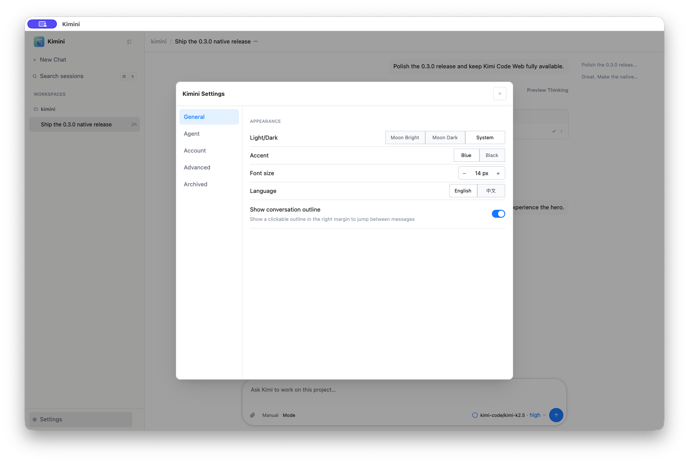

<div align="center">


# Kimini

**A focused native desktop for Kimi Code — plus a separate Web compatibility app.**

[English](README.md) · [简体中文](README_CN.md)

<a href="https://github.com/reedchan7/kimini/releases/latest"></a>
<a href="#compatibility-and-release-facts"></a>
<a href="#compatibility-and-release-facts"></a>


<a href="LICENSE"></a>

</div>



Kimini connects directly to the local [Kimi Code](https://github.com/MoonshotAI/kimi-code)
daemon, keeps your existing sessions, and gives you a fast GPUI-native coding
workspace. Kimini Web stays available as an independent companion for exact
compatibility with the daemon-served Web interface.

## Choose your app

| | **Kimini** | **Kimini Web** |
|---|---|---|
| Best for | Daily native workflow | Exact Web UI compatibility |
| Interface | GPUI | Kimi Code Web in the system webview |
| Connection | Typed REST + WebSocket | Daemon-served Web UI |
| Renderer | Metal / Vulkan / DirectX | WKWebView / WebKitGTK / WebView2 |
| Browser cost | Human preview only, on demand | System web process family |

Install both: they use the same local daemon, authentication, and session data.

## Platform status

| Platform | Architectures | Current status |
|---|---|---|
| macOS 14+ | Apple Silicon, Intel | Released; signed Sparkle update channel |
| Linux | x86_64, ARM64 | Portable preview; Debian 12 / Ubuntu 24.04 class runtime |
| Windows 10/11 | x86_64, ARM64 | Source probe and packaging ready; target-host qualification pending |

Linux archives are built locally through Docker Buildx. Both apps and architectures
have been launched from the distributed archives in Debian 12 / Ubuntu 24.04
environments. Both Windows MSVC targets pass a source-level cross probe. Windows
release builds still run on Windows: GPUI needs the native toolchain and Windows
SDK shader compiler, and ARM64 needs a real Windows ARM64 run.

## Why Kimini

- **Native where it matters.** Conversation, composer, sessions, settings, files,
  tasks, skills, goals, terminal tabs, and coding surfaces are rendered by GPUI.
- **Your Kimi workflow stays intact.** Kimini discovers or starts `kimi server`
  and consumes its authenticated `/api/v1` REST and WebSocket contracts directly.
- **Web compatibility remains one app away.** Kimini Web preserves the same UI,
  storage, sessions, and authentication as `kimi web`.
- **One codebase, platform-native rendering.** Metal powers macOS, Vulkan powers
  Linux, and the Windows port uses DirectX; the Web app uses each OS web engine.
- **Browser resources are on demand.** The native preview is created only when
  Browser is open. Linux Wayland opens preview/OAuth links in the system browser;
  X11, macOS, and Windows retain the embedded child view.
- **Updates follow the package owner.** macOS has signed in-app replacement.
  The portable native app routes Update to the latest release without privileged
  self-replacement; Kimini Web users update from Releases.

Compared with a broad agent environment such as
[Codex](https://openai.com/index/introducing-the-codex-app/), Kimini is purpose-built
for people already using Kimi Code: one daemon, one history, and native or Web
desktop surfaces. Model quality and unmatched cross-product benchmarks are outside
this comparison.

## Quick start

Install [Kimi Code](https://www.kimi.com/help/kimi-code/cli-getting-started). On
macOS or Linux:

```sh
curl -fsSL https://code.kimi.com/kimi-code/install.sh | bash
```

On Windows, install Git for Windows, then use PowerShell:

```powershell
irm https://code.kimi.com/kimi-code/install.ps1 | iex
```

Open a new terminal, run `kimi`, and enter `/login` on first launch.

Download the matching app and architecture from
[Releases](https://github.com/reedchan7/kimini/releases/latest):

- macOS: `Kimini-<version>-macos-<arch>` or `Kimini-Web-...` (`.dmg` / `.zip`)
- Linux preview: `Kimini-<version>-linux-<arch>.tar.gz` or `Kimini-Web-...`
- Windows qualification assets: `Kimini-<version>-windows-<arch>.zip` or
  `Kimini-Web-...` once a target-host build has completed

On Linux, install GTK 3, WebKitGTK 4.1, Vulkan, and your desktop portal, then
extract the archive and run `bin/kimini` or `bin/kimini-web`. A desktop entry and
icon are included under `share/`.

Kimini reads the platform home directory's `.kimi-code/server/lock` and
`server.token`, health-probes the daemon, and starts `kimi server run` when needed.
Credentials remain in request headers or the WebSocket subprotocol; they never
enter browser URLs.

## Native experience

The 0.3 line includes session creation, search, rename, archive/restore, fork,
compact, undo, attachments, streaming, thinking and tool traces, approvals and
questions, runtime modes, files, tasks, skills, goals, side chat, terminal tabs,
authentication, English/Chinese UI, themes, and keyboard-first navigation.

<details>
<summary><strong>Settings, appearance, language, account, and agent defaults</strong></summary>



</details>

| Shortcut | Surface |
|---|---|
| `⌘/Ctrl` + `Shift` + `E` | Files |
| `⌘/Ctrl` + `Shift` + `K` | Skills |
| `⌘/Ctrl` + `J` | Terminal |
| `⌘/Ctrl` + `Shift` + `T` | Tasks |

## Compatibility and release facts

- Direct daemon integration uses Kimi Code's self-described REST and WebSocket
  protocols; it does not scrape CLI/TUI output.
- The terminal prefers the daemon backend and retains a local Rust PTY fallback.
- macOS aarch64 app bundles are **17.1 MiB** native and **4.8 MiB** Web with the
  updater embedded. Linux ARM64 portable archives are **11.6 MiB** and **597 KiB**.
  Archive and app-bundle figures are different package scopes.
- Protocol and pure state logic currently have **97.03% line coverage**. The local
  native/Web suite contains **189 automated tests**.

The native app is an early release. Windows packaged-app behavior, Linux distro
breadth, CJK composition, long-session performance, streaming accessibility, rich
media, and complete interactive terminal behavior remain active hardening areas.
Matched CPU and memory results will be published only after full process-family
measurements are repeatable on every platform.

## Build from source

Rust 1.96+ is required.

```sh
make run             # native app on the current host
make run-web         # Web compatibility app
make package-all     # macOS: two apps, two architectures, DMG + zip
make package-linux   # macOS/Linux: x86_64 + ARM64 tarballs via Docker Buildx
```

From a Visual Studio 2022 Developer PowerShell on Windows:

```powershell
./scripts/package-windows.ps1 -App all -Arch all
```

The Windows builder needs the Desktop C++ workload, x64 and ARM64 MSVC tools,
Windows 10/11 SDK, Rust targets, and WebView2. The strict local release coordinator
can aggregate macOS, Linux, and Windows assets with `make publish-release-all`;
it refuses a partial matrix.

See the [platform research](docs/research/2026-07-19-windows-linux-platform-support.md),
[native GUI specification](docs/native-gui-spec.md), and
[framework decision](docs/native-gui-framework-selection.md) for deeper details.

---

Community-built and independent. Kimi and Kimi Code are products of Moonshot AI.
Kimini is not affiliated with Moonshot AI.

[MIT](LICENSE) · [Issues](https://github.com/reedchan7/kimini/issues) · Built with
[GPUI](https://github.com/zed-industries/zed/tree/main/crates/gpui),
[gpui-component](https://github.com/longbridge/gpui-component),
[wry](https://github.com/tauri-apps/wry), and
[tao](https://github.com/tauri-apps/tao), with macOS updates powered by
[Sparkle](https://sparkle-project.org/).
